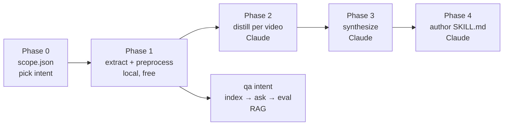

# Learning walkthrough: Python + AI, using this project as your textbook

> **Who this is for:** you're new to Python and to AI/LLM engineering, and you
> want to (a) actually understand what the code in this repo does and (b) be
> able to defend it in an interview. Every concept below is tied to a real file
> in `scripts/` — no toy examples. Read it with the file open in a split pane.

**How to use this doc.** Go top to bottom once for the mental model. Then keep
the **Interview question bank** (Part 6) open and practice saying the answers
out loud. The goal is not to memorize — it's to be able to point at a file and
explain *why it is the way it is*, because you reviewed and approved every one
of these decisions.

---

## Part 0 — The one-paragraph mental model

This project turns a **YouTube playlist into reusable AI artifacts**. The heavy,
mechanical work (downloading captions, transcribing, cleaning text) runs
**locally and free**. The *thinking* work (distilling ideas, synthesizing
patterns, answering questions) is done by **Claude**, an LLM, called through a
thin Python layer. The newest feature — the one that matters most for interviews
— is **RAG**: you index a playlist into a searchable form, then ask questions
and get answers that are **grounded in the transcripts with exact
`[video_NN @ MM:SS]` citations**, or an honest "the playlist doesn't cover
this."

The whole system is a **pipeline of phases**, each writing a plain file the next
phase reads:



Two design principles run through everything, and interviewers love hearing them:

1. **Every step is a flat file you can open and read.** Nothing is a hidden
   black box. This makes the system *inspectable* and *resumable*.
2. **Adapters isolate the expensive/replaceable parts.** The LLM and the
   embedding model each sit behind a single swappable seam, so the pipeline code
   never knows which provider it's talking to.

---

## Part 1 — The Python you need, taught from real files

You don't need to learn all of Python. You need the ~8 patterns this codebase
actually uses. Here they are, each anchored to a file.

### 1.1 Modules and "how does `python scripts/foo.py` even work?"

A `.py` file is a **module**. When you run `python scripts/rag_ask.py`, Python
puts the `scripts/` folder first on its import path, so a line like
`import scope` inside `rag_ask.py` finds `scripts/scope.py` next to it. That's
why every script does flat imports like `from embeddings import get_embedder`
(`scripts/rag_ask.py:30`) rather than package-style imports.

The bottom of almost every script has this:

```python
if __name__ == "__main__":
    sys.exit(main())
```

`__name__` equals `"__main__"` only when the file is **run directly**, not when
it's **imported**. So `rag_eval.py` can do `from rag_ask import retrieve`
(`scripts/rag_eval.py:30`) to *reuse* a function without accidentally running
`rag_ask`'s `main()`. `sys.exit(main())` makes the process exit code equal to
`main()`'s return value (`0` = success), which is how shell tools and CI detect
failure.

> **Interview soundbite:** "The `if __name__ == '__main__'` guard lets a file be
> both an executable script and an importable library. I use it so the eval
> harness can import the retriever from the ask script without side effects."

### 1.2 Type hints — they're documentation the tools can check

```python
def retrieve(question, meta, chunks, vectors, top_k, provider_override, model_override):
```
(`scripts/rag_ask.py:68`)

Function signatures like `def embed_documents(self, texts: list[str]) -> list[list[float]]:`
(`scripts/embeddings.py:55`) say "this takes a list of strings and returns a
list of lists of floats." Python does **not enforce** these at runtime — they're
for humans and for tools like `mypy`/your editor. `str | None` means "a string or
`None`." Get comfortable reading them; they tell you the shape of the data
flowing through the pipeline.

### 1.3 `dataclass` — a struct with less boilerplate

Look at `scripts/pricing.py:15`:

```python
@dataclass(frozen=True)
class ModelPrice:
    input_per_m: float
    output_per_m: float
    cache_read_per_m: float
    cache_write_per_m: float
```

A `@dataclass` auto-generates the `__init__`, `__repr__`, and equality for you.
`frozen=True` makes instances **immutable** (you can't reassign fields after
creation) — correct for a price table, which shouldn't change under you.

`scripts/scope.py:43` uses a mutable dataclass with **default factories**:

```python
@dataclass
class Scope:
    intent: str = "method-distillation"
    models: dict = field(default_factory=lambda: dict(DEFAULT_MODELS))
```

Why `field(default_factory=...)` instead of `models={}`? Because a plain mutable
default (`models: dict = {}`) is the classic Python footgun — **all instances
would share one dict**. The factory makes a fresh dict per instance. This is a
*very* common interview gotcha.

> **Interview soundbite:** "Never use a mutable default argument in Python.
> Dataclasses force you to use `default_factory` for exactly that reason —
> otherwise every `Scope()` would share the same `models` dict."

### 1.4 The Adapter pattern — the most important design idea in the repo

An **adapter** is a small class that hides *which* external thing you're talking
to behind a stable interface. This codebase has two, and they're the thing to
talk about in a system-design interview.

**Adapter #1 — the LLM.** `scripts/claude_client.py` wraps Anthropic's SDK:

```python
class ClaudeClient:
    def complete(self, *, system: str, user: str, cache_system: bool = True, ...) -> CompletionResult:
```
(`scripts/claude_client.py:66`)

Every phase calls `client.complete(...)`. None of them import the Anthropic SDK
directly. So if you wanted to swap Claude for a different provider, or a mock in
tests, you change **one file**.

**Adapter #2 — embeddings.** `scripts/embeddings.py` defines an abstract base
class (ABC) and four implementations behind one factory:

```python
class Embedder(ABC):
    @abstractmethod
    def embed_documents(self, texts: list[str]) -> list[list[float]]:
        ...
```
(`scripts/embeddings.py:47`)

`ABC` + `@abstractmethod` means "you cannot instantiate `Embedder` directly; a
subclass **must** implement `embed_documents`." The four subclasses —
`HashEmbedder`, `LocalEmbedder`, `VoyageEmbedder`, `OpenAIEmbedder` — each fill
that contract, and `get_embedder(provider, model)` (`scripts/embeddings.py:215`)
picks one by name. The RAG code just calls `emb.embed_documents(...)` and never
knows or cares which backend answered.

> **Interview soundbite:** "I put the LLM and the embedding model each behind an
> adapter — an abstract interface with swappable implementations selected by a
> factory. The pipeline depends on the interface, not the vendor. That's the
> Dependency Inversion Principle, and it's why switching from local embeddings
> to a hosted API is a config change, not a code change."

### 1.5 Lazy imports — why `import numpy` is *inside* functions

Notice `import numpy as np` appears **inside** functions
(`scripts/rag_index.py:167`, `scripts/rag_ask.py:61`), not at the top of the
file. And in `embeddings.py`, `import voyageai` is inside `VoyageEmbedder.__init__`
(`scripts/embeddings.py:161`), not at module top.

Why? Because merely **importing** `rag_ask.py` (which CI does to sanity-check it)
should not require numpy, fastembed, or any vendor SDK to be installed. Heavy or
optional dependencies are imported only when the code path that needs them
actually runs. This keeps the local, free phases dependency-light and lets the
project degrade gracefully ("install fastembed to use local embeddings")
instead of crashing on startup.

> **Interview soundbite:** "Optional dependencies are lazy-imported inside the
> function that uses them, so importing the module never forces the heavy deps.
> It keeps startup cheap and lets features be optional."

### 1.6 `argparse`, `pathlib`, and the CLI shape

Every script is a small command-line program. `argparse`
(`scripts/rag_index.py:116`) turns `--chunk-size 220` into `args.chunk_size == 220`.
`pathlib.Path` (`from pathlib import Path`) is the modern way to handle files:
`distilled_dir / "chunks.jsonl"` builds a path with the `/` operator, and
`.exists()`, `.read_text()`, `.write_text()` do the obvious things. You'll see
this everywhere; once you recognize it, the file I/O reads like English.

---

## Part 2 — LLM fundamentals, grounded in the cost code

### 2.1 Tokens and why everything is priced per-million

LLMs don't see characters or words; they see **tokens** (~¾ of a word on
average). You pay per token, and **input** (what you send) and **output** (what
the model writes) are priced differently. The real table is in
`scripts/pricing.py:25`:

```python
PRICES = {
    "claude-opus-4-7":            ModelPrice(15.00, 75.00, 1.50, 18.75),
    "claude-sonnet-4-6":          ModelPrice( 3.00, 15.00, 0.30,  3.75),
    "claude-haiku-4-5-20251001":  ModelPrice( 1.00,  5.00, 0.10,  1.25),
}
```

Numbers are **USD per 1,000,000 tokens**. Two lessons an interviewer will want
you to know:

1. **Output is ~5× the price of input.** So keeping model answers short (this
   repo caps answers at `max_tokens=1024` in `rag_ask.py:121`) is a real cost
   lever, not just tidiness.
2. **Model choice is a cost/quality dial.** The pipeline uses cheap **Haiku**
   for the mechanical per-video distillation and pricier **Sonnet** for
   synthesis and answering (`scripts/scope.py:18`). That's deliberate: spend
   money where reasoning quality matters.

### 2.2 Prompt caching — the "cache_read" columns

See those 3rd and 4th price columns (`cache_read_per_m`, `cache_write_per_m`)?
They're ~10× cheaper than fresh input. That's **prompt caching**: if you send
the same big system prompt on many calls, you pay full price to "write" it to
cache once, then a fraction to "read" it on subsequent calls. The code opts in
here:

```python
system_param = [{
    "type": "text",
    "text": system,
    "cache_control": {"type": "ephemeral"},
}]
```
(`scripts/claude_client.py:78`)

In Phase 2, the same distillation instructions are sent for all 40 videos — so
caching the instruction block turns 40× full-price system prompts into 1 write +
39 cheap reads.

> **Interview soundbite:** "Prompt caching amortizes a large, stable system
> prompt across many calls. We cache the instruction block so a 40-video batch
> pays to encode it once, then reads it at ~a tenth of the price."

### 2.3 System vs user prompt

`complete(system=..., user=...)` — the **system** prompt sets the rules and role
("you answer only from these excerpts, cite them, refuse otherwise"), the
**user** message carries the actual data (the question + retrieved text). Keeping
instructions in `system` (stable → cacheable) and data in `user` (changes every
call) is both a quality and a cost decision.

### 2.4 Retries with exponential backoff

Networks and rate limits fail. `claude_client.py:88` retries transient errors
with a doubling delay (`delay *= 2`): wait 2s, then 4s, then 8s… This is
**exponential backoff**, standard practice for any remote API. Know the term.

---

## Part 3 — RAG, the centerpiece (learn this cold)

RAG = **Retrieval-Augmented Generation**. Plainly: instead of hoping the LLM
"remembers" the playlist, you **retrieve** the most relevant transcript pieces
and **hand them to the model** as context, then ask it to answer using only
those. This is *the* dominant pattern in applied LLM work today, and the most
likely thing you'll be grilled on.

### Why RAG instead of "just paste everything" or "fine-tune"?

- **Context limits + cost.** A 40-video playlist is huge; you can't fit it all
  in one prompt, and even if you could, you'd pay for all of it on every
  question. Retrieval sends only the ~6 relevant chunks.
- **Freshness & control.** No model retraining; update the index and the answers
  update. And because you know exactly which chunks you sent, you can force
  **citations** and detect when the answer isn't grounded.
- **Fine-tuning is the wrong tool** for "answer questions about this specific
  corpus" — it teaches *style/behavior*, not *facts you can cite*.

The RAG flow in this repo has four moving parts. Follow them in order.

### 3.1 Embeddings — turning text into vectors (`embeddings.py`)

An **embedding** is a list of numbers (a **vector**, e.g. 384 floats) that
represents the *meaning* of a piece of text. The key property: **texts with
similar meaning get vectors that point in similar directions.** "compound
interest" and "money growing over time" land near each other even though they
share no words. That's what makes search *semantic* instead of keyword-matching.

This repo has four embedders behind the `Embedder` interface:

| provider | what it is | needs |
|----------|------------|-------|
| `local`  | a real model (`bge-small`) running on your CPU, offline, $0 | `fastembed` or `sentence-transformers` |
| `hash`   | a **non-semantic** hashing baseline — deterministic, zero-dependency | nothing |
| `voyage` | Voyage AI hosted API (Anthropic's embeddings partner) | `VOYAGE_API_KEY` |
| `openai` | OpenAI hosted API | `OPENAI_API_KEY` |

Two subtle, interview-worthy details actually in the code:

**(a) Query vs document asymmetry.** Some models embed a *question* differently
from a *passage*. `bge` wants a special instruction prepended to queries only:

```python
_BGE_QUERY_INSTRUCTION = "Represent this sentence for searching relevant passages: "
```
(`scripts/embeddings.py:41`, applied in `embed_query` at `:145`)

That's why the interface has both `embed_documents` and `embed_query`. Getting
this wrong quietly hurts retrieval quality.

**(b) The `hash` provider is a teaching/testing tool.** It hashes words into
buckets (`scripts/embeddings.py:64`). It's **not** semantic — "car" and
"automobile" won't match — but it needs no downloads and is deterministic, so
it's perfect for running the whole pipeline offline to learn the *mechanics*
before installing a real model. Use `local` for anything real.

### 3.2 Chunking — and why *this* project chunks by timestamp (`rag_index.py`)

You can't embed a whole 15-minute transcript as one vector — too much meaning
crammed into one point. You **chunk** it into overlapping windows. Here: 220
words per chunk, 40 words of overlap (`scripts/rag_index.py:123`). Overlap
prevents an idea that straddles a boundary from being split and lost.

The clever part unique to this project: it chunks over the **timestamped**
transcript (`transcript.timestamped.json`), so **every chunk remembers the
`start`/`end` time of the speech it came from** (`scripts/rag_index.py:98`).
That's what makes `[video_03 @ 04:12]` citations possible later. The comment in
the file says it well: "the timestamped citation is the whole point, so we chunk
the timestamped source, not the flat clean text."

Each chunk is written as one line of `chunks.jsonl`:
`{id, video, start, end, text}` — a **JSONL** file (one JSON object per line),
which is the standard format for streamable record data.

### 3.3 The vector store — cosine similarity done simply (`rag_index.py` + `rag_ask.py`)

After embedding every chunk, the vectors are stacked into a matrix and saved as
`rag_index.npz` (a compressed numpy file). Before saving, they're
**normalized** to length 1 (`scripts/rag_index.py:171`). Here's why that matters
and it's a great thing to explain in an interview:

**Cosine similarity** measures the *angle* between two vectors (meaning
similarity), ignoring their length. Normally that's `dot(a,b) / (‖a‖·‖b‖)`. But
if every vector is pre-normalized to length 1, the denominator is 1, so
similarity becomes just the **dot product** — one fast matrix multiply for *all*
chunks at once:

```python
scores = vectors @ q          # cosine, because everything is unit-length
top = np.argsort(-scores)[:k]  # indices of the k highest scores
```
(`scripts/rag_ask.py:83`)

This project uses a plain numpy matrix instead of a heavyweight vector database
(FAISS, Chroma, Pinecone) — the right call for playlist-sized data (hundreds to
low-thousands of chunks). Know *when* you'd graduate to a real vector DB:
millions of vectors, need for filtered search, or concurrent updates.

**The embedder-identity guard** — a maturity signal. The index records *which
embedder built it* (`scripts/rag_index.py:184`), and querying refuses to run if
the question would be embedded by a different one:

```python
if emb.name != meta.get("embedder"):
    sys.exit("Embedder mismatch: index was built with ... but this query would use ...")
```
(`scripts/rag_ask.py:72`)

Why? **You cannot compare vectors from two different embedding models** — the
numbers live in different spaces; the similarity scores would be garbage. Most
tutorials skip this; catching it shows you understand what embeddings actually
are.

### 3.4 Grounded generation — retrieval + honest citations (`rag_ask.py` + `06_rag_answer.md`)

Retrieval found the top-k chunks. Now generation. The code builds a context
block where **each excerpt is prefixed with its citation label**
(`scripts/rag_ask.py:89`), then sends it to Claude with the system prompt in
`prompts/06_rag_answer.md`. That prompt is where "trustworthiness" is
engineered. Its rules:

- Cite every claim with the **exact** `[video_NN @ MM:SS]` label, copied
  verbatim.
- If the excerpts don't answer it, say **"The playlist doesn't cover this."**
- Any outside knowledge must be flagged **"⚠️ Not from the playlist"** and may
  **never** carry a citation.

This is how you fight **hallucination** (the model confidently making things up):
constrain it to provided context, make refusal an explicit allowed output, and
make grounding checkable via citations.

**The `--retrieve-only` mode** (`scripts/rag_ask.py:100`) is a smart engineering
touch: it prints the retrieved chunks *without* calling Claude ($0), so you can
inspect *whether retrieval is even working* before paying for generation. When a
RAG answer is bad, the first question is always "was it bad retrieval or bad
generation?" — this mode answers that.

---

## Part 4 — Evaluation: the thing that separates you from the pack

Here's the hard interview truth: **almost everyone can build a RAG demo; very
few can tell you whether it's any good.** Evaluation is the differentiator.
`scripts/rag_eval.py` + `prompts/07_rag_eval.md` implement it.

### 4.1 LLM-as-judge

You can't hand-grade hundreds of answers. So you use a **second LLM call as a
judge**: give it the question, the retrieved context, and the answer, and ask it
to score. The judge prompt (`prompts/07_rag_eval.md`) returns strict JSON.

### 4.2 The three RAGAS-style metrics (memorize these)

From `prompts/07_rag_eval.md`:

- **faithfulness** — is every claim in the answer *supported by the retrieved
  context*? (Catches hallucination.)
- **answer_relevance** — does the answer actually address the question? (A
  correct "doesn't cover this" for an uncovered question scores *high* — refusing
  well is good behavior.)
- **context_relevance** — were the *retrieved chunks* actually relevant? (This
  grades **retrieval**, separately from generation.)

That third one is the key insight: **it isolates the two failure modes.** Low
context_relevance = fix your retriever (chunking, embeddings, k). High
context_relevance but low faithfulness = fix your generation prompt. This maps
directly onto the `--retrieve-only` debugging tool from Part 3.

### 4.3 Be honest about the method

The docstring says it outright (`scripts/rag_eval.py:12`): this is a
**meta-eval — Claude grading Claude** — which has known biases (a model tends to
like answers shaped like its own). Treat it as a **relative signal across runs**
(did my change make the number go up?), not absolute truth, and spot-check by
hand. **Saying this unprompted in an interview signals real maturity** — you know
the limits of your own tooling.

The harness runs each eval question through retrieve → answer → judge, then
**aggregates the mean per metric** into `rag_score.json`
(`scripts/rag_eval.py:135`). It also seeds the eval set with a deliberately
uncovered question ("airspeed velocity of an unladen swallow",
`scripts/rag_eval.py:51`) to test that the system *refuses* rather than
hallucinates — that's a **negative test case**, and knowing to include one is
itself a skill.

---

## Part 5 — Hands-on lab: run it yourself, offline, for $0

You learn this by *running* it, breaking it, and reading the files it writes. The
`hash` embedder needs no model download and no API key, so you can exercise the
entire retrieval half offline. (The *answer* step needs an Anthropic API key;
the *retrieve-only* step does not.)

```bash
# 0. one tiny dependency for the vector math
pip install numpy

# 1. get a few videos of a playlist you're entitled to use
make extract-batch PLAYLIST="<url>" PLAYLIST_NAME=demo VIDEOS=1-3
make preprocess PLAYLIST_NAME=demo

# 2. build the RAG index with the zero-dep hash embedder
python scripts/rag_index.py --playlist demo --provider hash

#    → open distilled/demo/chunks.jsonl and rag_index.meta.json and READ them.
#      This is the whole point: nothing is hidden.

# 3. inspect retrieval WITHOUT paying for generation
python scripts/rag_ask.py --playlist demo \
    --question "what does the creator say about X?" --retrieve-only

#    → you'll see the top chunks and their [video_NN @ MM:SS] citations + scores.
```

Then graduate to real semantic search and real answers:

```bash
pip install fastembed anthropic
export ANTHROPIC_API_KEY=sk-...
python scripts/rag_index.py --playlist demo --provider local   # bge-small
python scripts/rag_ask.py   --playlist demo --question "..."    # grounded answer + citations
python scripts/rag_eval.py  --playlist demo --sample            # scaffold an eval set
# edit distilled/demo/qa_eval.jsonl, then:
python scripts/rag_eval.py  --playlist demo                     # scores → rag_score.json
```

**Experiments that teach you the most** (do these, then explain what changed):
1. Compare `--provider hash` vs `--provider local` retrieval on the same
   question. Watch semantic search find things keyword-hashing misses.
2. Change `--chunk-size` and `--overlap` and re-index. Tiny chunks → precise but
   fragmented; huge chunks → context-rich but noisy. This tradeoff is a classic
   interview question.
3. Ask something the playlist clearly *doesn't* cover and confirm the answer
   refuses instead of inventing.

---

## Part 6 — Interview question bank (practice out loud)

### RAG / AI

**Q: What is RAG and why use it over a long context window or fine-tuning?**
Retrieval-Augmented Generation: embed and index your corpus, retrieve the most
relevant chunks for a query, and pass them to the LLM as grounding context.
Beats stuffing everything in context on **cost and scale** (send 6 chunks, not
40 videos), and beats fine-tuning for **factual, citable, updatable** knowledge —
fine-tuning changes behavior/style, not a fact base you can cite or refresh.

**Q: Walk me through your retrieval.** Chunk transcripts into 220-word windows
with 40-word overlap, carrying each chunk's timestamp. Embed each chunk into a
unit-normalized vector; stack into a matrix. At query time, embed the question
with the *same* model, and because vectors are normalized, cosine similarity is a
single dot-product matrix multiply; take the top-k by score.

**Q: How do you stop it hallucinating?** Three layers: (1) the prompt constrains
the model to answer only from provided excerpts; (2) refusal ("the playlist
doesn't cover this") is an explicit allowed output, and any outside knowledge
must be labeled and uncited; (3) an eval harness scores **faithfulness** to catch
ungrounded claims, plus a negative test case that *should* be refused.

**Q: A RAG answer is wrong. How do you debug it?** Split retrieval from
generation. Use retrieve-only mode to see if the right chunks came back. Low
retrieval quality → fix chunking/embeddings/k. Good chunks but bad answer → fix
the generation prompt. My eval separates these as `context_relevance` vs
`faithfulness`.

**Q: Why normalize the embedding vectors?** So cosine similarity reduces to a dot
product — the length term drops out — which lets me score all chunks with one
matrix multiply instead of computing norms per query.

**Q: When would you replace the numpy matrix with a real vector DB?** At scale:
millions of vectors, need for metadata-filtered search, approximate-nearest-
neighbor speed, or concurrent writes. For playlist-sized data (hundreds–low
thousands of chunks) an exact numpy scan is simpler and fast enough.

**Q: How do you evaluate RAG?** LLM-as-judge over a small labeled question set,
scoring faithfulness, answer-relevance, and context-relevance. I treat it as a
relative signal (it's a meta-eval with known biases), track it across changes,
and spot-check by hand. I include uncovered questions to test refusal.

### Python

**Q: Mutable default arguments?** Never do `def f(x=[])` or a dataclass field
`items: list = []` — the default is created once and shared across calls. Use
`None` + create inside, or `field(default_factory=list)`.

**Q: What's an ABC / abstractmethod?** An abstract base class defines an
interface; `@abstractmethod` forces subclasses to implement a method and blocks
instantiating the base. I use it for the `Embedder` interface so all providers
are interchangeable.

**Q: Why lazy imports?** To keep module import cheap and dependencies optional —
heavy libs (numpy, vendor SDKs) are imported inside the function that needs them,
so importing the module (e.g. in CI) doesn't require them installed.

**Q: `if __name__ == "__main__"`?** True only when the file is run directly, not
imported. Lets a file be both a CLI and an importable library.

### System design / "tell me about your project"

**Q: Walk me through the architecture.** (Say this in ~45 seconds.) "It's a
phased pipeline that converts a YouTube playlist into reusable artifacts. Local,
free phases handle download/transcription/cleaning. Then LLM phases distill each
video, synthesize cross-video patterns, and author outputs — or, in the RAG
intent, index the transcripts for grounded Q&A with timestamped citations. Two
adapters isolate the replaceable parts: one for the LLM, one for the embedding
model, so swapping providers is a config change. Every phase writes an
inspectable flat file, so it's resumable and debuggable, and there's an eval
harness that scores answer faithfulness and retrieval quality."

**Q: What was a deliberate tradeoff?** Local-first embeddings by default to keep
it free and offline, with a hosted-API switch behind the same interface for when
quality matters — and I checked that the cost difference for indexing a playlist
is fractions of a cent, so the choice is about the offline principle, not money.

---

## Part 7 — What to say about where it's going

Interviewers love a candidate with a roadmap and a reason. The honest framing:
RAG (this) is the **foundation**; the next features **compound on it** —
retrieval → personalization → agentic planning. Second-brain recommendations and
a syllabus-builder both reuse this retrieval layer. (See `todo.md` for the
full plan.) Being able to say *why RAG comes first* — because it's the
reusable substrate and the highest-leverage skill — is itself the kind of
prioritization thinking interviews probe for.

---

## One-page cheat sheet (screenshot this before an interview)

- **RAG** = retrieve relevant chunks → ground the LLM → cite sources.
- **Embedding** = vector capturing meaning; similar meaning ⇒ similar direction.
- **Chunking** here = 220 words / 40 overlap, over *timestamped* segments ⇒
  citable.
- **Cosine sim** = dot product *after normalizing* ⇒ one matrix multiply.
- **Embedder guard** = can't compare vectors from different models.
- **Grounding** = prompt forces citations + explicit refusal ⇒ anti-hallucination.
- **Eval** = LLM-as-judge on faithfulness / answer-relevance / context-relevance;
  it's a relative signal, not truth.
- **Adapters** = LLM and embeddings each behind one swappable seam
  (Dependency Inversion).
- **Cost levers** = cheap model for grunt work, prompt caching for repeated
  system prompts, short `max_tokens` because output is ~5× input price.
- **Python gotchas** = mutable defaults, `__name__=="__main__"`, lazy imports,
  ABCs.
